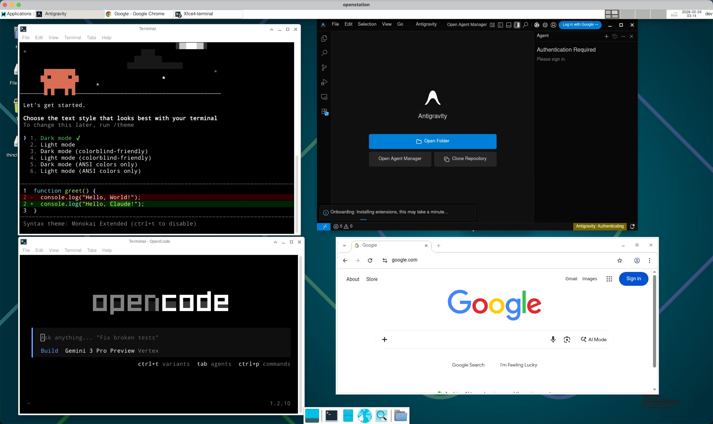

[English](./README.md)



# 💡 动机

作为一个重度依赖AI写代码的人，经常遇到一些难受的地方：MacBook 上的Claude Code/Antigravity/... 正在跑一个关键且耗时的任务，但我得合上盖子去吃午饭或者通勤。砰——任务中断了。

我开发 **OpenStation** 就是为了解决这个痛点。我想要一个不知疲倦、永远在线的容器化工作区，让我的开发工作流 24/7 全天候运行，完全不受我本地硬件状态的影响。

通过RDP，你可以从任何设备——iPhone、iPad 或 Android——无缝连接到你那个装备齐全的工作区。无论你是在买咖啡、坐火车，甚至是在**蹲马桶**，你都能轻松连进去，查看 AI 的进度，并随时分派新任务。

# 快速开始
```yaml
services:
  openstation:
    image: ghcr.io/darkedx/openstation:latest
    privileged: true
    restart: always
    shm_size: '1gb' # 使用Chrome浏览网页需要分配共享内存
    ulimits: # 放宽文件描述符和消息队列限制， 避免同一个宿主机运行了多个OpenStation的情况下，搜狗输入法出现问题
      nofile:
        soft: 65536
        hard: 65536
      msgqueue:
        soft: 8192000
        hard: 8192000
    # 可选，是否将nvidia显卡分配给容器(OpenStation已经安装了nvidia驱动)
    # runtime: nvidia 
    # deploy:
    #   resources:
    #     reservations:
    #       devices:
    #         - capabilities: [gpu]
    environment:
      AUTO_INSTALL: claude,gemini,antigravity,fvm,kiro,opencode,codex # 自动安装的工具与软件, 可查看AUTO_INSTALL变量介绍来获取所有可用值
      SSH_ROOT_KEY_DEFAULT: "ssh-ed25519 AAAxxxxxxxx..." # 你的SSH公钥
      RDP_PASSWORD: 123456 # 你的RDP密码
      SYSTEM_LANG: zh_CN # or en_US
    ports:
      - "2222:22" # SSH端口映射
      - "33389:3389" # RDP端口映射
    volumes:
      - ./data/ssh:/etc/ssh # ssh主机指纹持久化
      - ./home:/home/dev # 用户目录持久化


```

# 预装工具

OpenStation 基于 **Debian 13** 构建，预装了一套全面的开发工具：

## 桌面与环境
- **XFCE4**：轻量级桌面环境
- **XRDP**：RDP服务端， 支持所有RDP客户端
- **输入法**：Fcitx + 搜狗拼音（需手动下载搜狗输入法的安装包到~/.openstation/packages/下， 重启容器后会自动安装并配置）
- **浏览器**：Google Chrome

## 语言（由 [mise](https://mise.jdx.dev) 管理）
- **Node.js**
- **Python**
- **Go**
- **Java**
- **Rust**

## 核心工具
- **包管理器**：`apt`、`mise`、`homebrew`
- **编辑器与 Shell**：`vim`、`tmux`、`bash`
- **开发工具**：`git`、`docker`（Docker-in-Docker）、`build-essential`、`cmake`、`clang`、`ninja`
- **CLI 增强工具**：`curl`、`wget`、`jq`、`yq`、`ripgrep (rg)`、`bat`、`eza`、`btop`、`aria2`
- **数据库客户端**：`psql`、`mysql`、`redis-cli`
- **系统工具**：`supervisor`、`kopia`（备份）、`openssh-server`

# 我还编写了一些实用的脚本

gita：git worktree 管理工具， 方便同时对一个项目开发多个功能

xrdpmode：在 RFX 和 264 模式之间切换 RDP 设置，需重新连接生效

# 环境变量

OpenStation 支持通过 `AUTO_INSTALL` 环境变量在启动时自动安装/更新工具。

## AUTO_INSTALL

指定要在容器启动时安装或更新的工具，多个工具之间用逗号分隔。

支持的值包括：
- `gemini`: Google Gemini CLI
- `claude`: Claude Code
- `antigravity`: Antigravity - 谷歌的AI IDE
- `kiro`: Kiro AWS的AI IDE
- `fvm`: Flutter 版本管理工具
- `opencode`: OpenCode AI 编程助手
- `openclaw`: OpenClaw 网关
- `codex`: OpenAI Codex CLI
